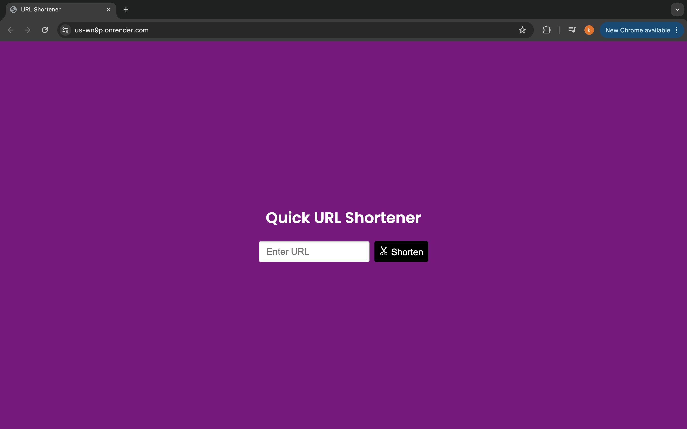

### URL Shortener
* a simple url shortener to keep me from boredom.

### Folder Structure
```
url-shortener
│
├── views
│   ├── index.html
│   ├── styles.css
│   └── script.js
│
├── src
│   ├── config
│   │   └── mongoose.js
│   │
│   ├── models
│   │   └── Url.js
│   │
│   ├── routes
│   │   └── url.js
│   │
│   ├── utils
│   │   └── base58.js
│   │
│   ├── test
│   │   └── url.test.ts
│   │
│   └── server.js
│
├── .env
├── jest.config.js
├── package.json
└── tsconfig.json

```
# URL Shortener Project Summary

Its a lazy saturday afternoon and i get bored easily, so i built this.

## How It Works

1. **Frontend**:
   - The frontend consists of an input form where users can enter the long URL they want to shorten.
   - When the form is submitted, a POST request is sent to the backend API with the long URL.
   - The backend responds with the shortened URL, which is then displayed on the frontend along with a "Copy" button.
   - Users can click the "Copy" button to copy the shortened URL to their clipboard. A confirmation message is displayed for a brief period after copying.

2. **Backend**:
   - The backend is built using Express and handles the URL shortening logic.
   - When a long URL is received, the backend checks if it already exists in the database. If it does, the existing shortened URL is returned.
   - If the long URL is new, it is encoded using a custom Base58 encoding function to generate a unique short code.
   - The long URL and its corresponding short code are stored in the MongoDB database.
   - When a user visits the shortened URL, the backend decodes the short code to find the original long URL in the database and redirects the user to it.

## Base58 Encoding and Decoding

The Base58 encoding scheme is used to generate a unique, short representation of a long URL. It avoids similar-looking characters to reduce the chance of errors when typing the short URL manually.

- **Alphabet**: The Base58 alphabet consists of `123456789abcdefghijkmnopqrstuvwxyzABCDEFGHJKLMNPQRSTUVWXYZ`, totaling 58 characters.
- **Encoding**:
  - The `encode` function takes a numeric value (typically the count of URLs) and converts it to a Base58 string.
  - It repeatedly divides the number by 58, using the remainder to find the corresponding character in the Base58 alphabet and building the encoded string from these characters.
  
  ```typescript
  export const encode = (num: number): string => {
    const alphabet = '123456789abcdefghijkmnopqrstuvwxyzABCDEFGHJKLMNPQRSTUVWXYZ';
    const base = alphabet.length;
    let encoded = '';
    while (num) {
      const remainder = num % base;
      num = Math.floor(num / base);
      encoded = alphabet[remainder].toString() + encoded;
    }
    return encoded;
  };

Decoding:

The decode function converts a Base58 string back into its numeric value.
It processes each character of the Base58 string, finding its index in the Base58 alphabet and computing the corresponding numeric value using positional notation (similar to base conversion).

```typescript

export const decode = (str: string): number => {
  const alphabet = '123456789abcdefghijkmnopqrstuvwxyzABCDEFGHJKLMNPQRSTUVWXYZ';
  const base = alphabet.length;
  let decoded = 0;
  while (str) {
    const index = alphabet.indexOf(str[0]);
    const power = str.length - 1;
    decoded += index * Math.pow(base, power);
    str = str.substring(1);
  }
  return decoded;
};

```
### Why Base58 over Base64 or Others?

* Avoidance of Similar-looking Characters
Base58 is designed to eliminate characters that can easily be confused with each other in certain fonts. This includes characters like 0 (zero), O (capital o), I (capital i), l (lowercase L), 5 (five), and S (capital s). This reduces the chance of errors when typing the shortened URL manually or reading it from a printed source.

* URL and File System Safety
Base64 includes characters such as +, /, and = which have special meanings in URLs and file systems. These characters need to be percent-encoded in URLs and can complicate handling in file systems. Base58 avoids these characters, making it safer for use in URLs and filenames without additional encoding.

* Human Friendliness
Base58 encoding results in strings that are more human-friendly and easier to use. The reduced set of characters makes the encoded strings more compact and easier to read and type.

* Efficiency
While Base64 is more space-efficient than Base58 (because it encodes using 64 characters instead of 58), the trade-off in readability and safety often makes Base58 the preferred choice for applications where URLs will be read, typed, or communicated by humans.

* Common Usage
Base58 is widely used in cryptocurrency and blockchain applications (e.g., Bitcoin addresses) for similar reasons. Its adoption in these areas has established it as a robust and well-understood encoding scheme for use cases requiring both compactness and human usability.

## Environment Variables

BASE_URL: Specifies the base URL for the generated short URLs. This allows the application to be flexible and work correctly in different environments.

MONGO_URI: Specifies mongodb connection string.

## Running the Application

Ensure MongoDB is running locally or on

Compile the TypeScript code and start the server using the following commands:

```client
tsc && node dist/server.js

```
Access the application by navigating to http://localhost:3000 in your web browser. Input a long URL to get a shortened version and test the redirection.


### 
